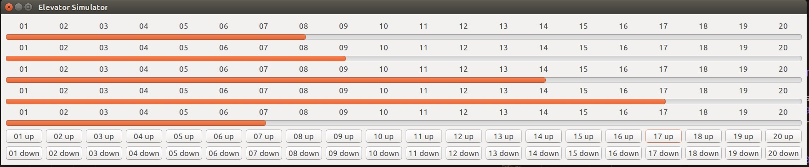

# 电梯调度模拟

## 1. 描述

某一栋楼20层，有五部互联的电梯。基于线程思想，编写一个电梯调度程序。

## 2. 环境

- Python 3.5+
- python-gkt 3.0
    - Linux下:
    `apt-get install -y python-gtk2`
    - Windows下：
    `= =`

启动程序：  
在当前目录下，输入命令:`python3 elevator.py`

## 3. UI界面


<center><caption><b>图1: 图形化界面</b></caption></center>

### 界面解释

5部电梯使用`Gtk.ProgressorBar`的进度条类模拟实现，进度条到达位置即为电梯当前所处位置，分别从01到20。下面共40个按钮使用`Gtk.Button`模拟实现，代表在该栋楼里20层的上下按钮，当乘客想要使用电梯即点按他当前所在层的up/down按钮，电梯则会调度来接乘客。

## 4. 代码逻辑实现

### 4.1 类

本项目中声明了如下五个类：

|Class | Usage |
|---|---|
|`Elevator`|描述整个电梯的行为和状态|
|`Request`|描述整栋楼里乘客点按的每个up/down请求|
|`Passenger`|描述进入电梯的乘客|
|`InitWindow`|整个项目的开始界面|
|`RequestWindow`|整个电梯调度的UI界面|

其中，`Elevator`,`Request`,`Passenger`均为逻辑实现类，`InitWindow`和`RequestWindow`为UI实现类。

### 4.2 整体逻辑实现

#### 4.2.1 线程间通讯 
程序分为1个主线程和5个子线程，其中主线程用于接收乘客点按的up/down请求，而每一个子线程模拟单部电梯的运行过程。所有线程之间使用`Queue`进行线程间通讯，Python自带的`Queue`自动解决了多线程间的读写冲突问题，所以我们只需要在不同的线程里读取`Queue`中的数据即可。
<center>

</center>
<center><caption><b>图2: 线程间通讯</b></caption></center>

#### 4.2.2 电梯模拟

1. **电梯在每一时刻的状态**
对于每部电梯拥有如下属性:
    - `curr_stair` 当前所在楼层(1~20)
    - `curr_direction` 该电梯当前运行方向(-1向下，0静止，1向上)
    - `curr_getting` 该电梯当前想要接的人
    - `further_passenger` 该电梯内部乘客中到达目的地最远的乘客
    - `passenger_list` 该电梯内部所有乘客

2. **电梯在每一楼层的行为**
对于电梯每到达一层（实际上设定为每一秒），均要顺序进行如下过程：
    - 检查电梯内部是否有乘客，如果有则根据乘客的目的地更新电梯的运行方向，如果没有则从`Queue`中取得新的`Request`。
    - 对于当前楼层，检查是否有要到该楼层的电梯内部乘客
    - 对于当前楼层，检查是否有想要上该电梯的乘客（同时检查是否接收该乘客）
<center>

</center>
<center>
<caption><b>图3: 电梯每层行为</b></caption>
</center>

```Python
def run(self,request_queue,progressbar):
    while(True):
        self.state_check()
        if self.curr_direction!=0:
            print('current at '+str(self.curr_stair))
        if self.further_passenger!=None:
            task_destination=self.further_passenger.destination
            self.get_direction(task_destination)
            self.check_passenger_down()
            self.check_passenger_up(request_queue)
            self.curr_stair+=self.curr_direction
            curr_percent=(self.curr_stair*18-9)/358
            progressbar.set_fraction(curr_percent)
            time.sleep(1)
        else:
            # the elavator has someone to pickup
            if self.curr_getting!=None:
                task_destination=self.curr_getting.request_stair
                self.get_direction(task_destination)
                self.check_passenger_up(request_queue)
                if self.further_passenger==None:
                    self.update_getting(request_queue)
                self.curr_stair+=self.curr_direction
                curr_percent=(self.curr_stair*18-9)/358
                progressbar.set_fraction(curr_percent)
            # if the elavator is idling now
            else:
                self.update_getting(request_queue)
                self.curr_stair+=self.curr_direction
                curr_percent=(self.curr_stair*18-9)/358
                progressbar.set_fraction(curr_percent)
            time.sleep(1)
```

3. **`check_passenger_down()`**
此函数用于检查当前楼层是否有乘客要下电梯。由于一个电梯中，保留电梯上乘客信息的有两个地方，首先是`further_passenger`，其次是`passenger_list`,我们遍历这两者中的乘客，如果有乘客的`destination`恰好为当前楼层，则我们将该乘客从`further_passenger`或`passenger_list`中移除。
```Python
def check_passenger_down(self):
    if self.further_passenger.destination==self.curr_stair:
        self.further_passenger=None
        return

    for each_passenger in self.passenger_list:
        if each_passenger.destination==self.curr_stair:
            self.passenger_list.remove(each_passenger)
    return
```

4. **`check_passenger_up()`**
此函数用于检查当前楼层是否要上电梯的乘客。首先判断当前楼层是否等于要上电梯乘客的楼层（从`Queue`中取`Request`进行依次比较），如果等于，还要判断乘客所给出的Request的方向是up还是down，如果其方向与电梯运行的方向相反，则依旧不允许该乘客乘坐电梯。如果上述条件均满足，则考虑在该乘客上电梯之前电梯中是否有人，如果没有则直接将新乘客设置为`further_passenger`,如果之前有人，即`further_passenger!=None`，则比较新来的乘客和之前的`further_passenger`的目的地哪一个更远，将最远的那个设置为`further_passenger`,另一个直接加入`passenger_list`中。
```Python
def check_passenger_up(self,request_queue):
    queue_list=[]
    # check if getting someone up
    if self.curr_getting!=None:
        if self.curr_getting.request_stair==self.curr_stair:
            self.curr_getting=None
            new_passenger_destination=ask_for_destination()
            new_passenger=Passenger(new_passenger_destination)
            # if there's no passenger before,
            # just add new passenger to further_passenger
            if self.further_passenger==None:
                self.further_passenger=new_passenger
            # if new passenger destination > curr passenger destination, 
            # update further_passenger state
            elif abs(new_passenger_destination-self.curr_direction)\
                >abs(self.further_passenger.destination-self.curr_direction):
                self.passenger_list.append(self.further_passenger)
                self.further_passenger=new_passenger
            # if new passenger destination < curr passenger destination,
            # add it to passenger_list
            elif abs(new_passenger_destination-self.curr_direction)\
                <abs(self.further_passenger.destination-self.curr_direction):
                self.passenger_list.append(new_passenger)
            # if new passenger's destination is same as another
            # passenger before, just merge them(do nothing).
            else:
                pass
            self.recheck_direction()
            return
    while(not request_queue.empty()):
        request_item=request_queue.get()
        # if the request meets the requirement of curr 
        # elavator state, get it into elavator.
        if request_item.request_stair==self.curr_stair\
            and request_item.direction==self.curr_direction:
            # passenger can be picked up
            new_passenger_destination=ask_for_destination()
            new_passenger=Passenger(new_passenger_destination)
            # if there's no passenger before,
            # just add new passenger to further_passenger
            if self.further_passenger==None:
                self.further_passenger=new_passenger
            # if new passenger destination > curr passenger destination, 
            # update further_passenger state
            elif abs(new_passenger_destination-self.curr_direction)\
                >abs(self.further_passenger.destination-self.curr_direction):
                self.passenger_list.append(self.further_passenger)
                self.further_passenger=new_passenger
            # if new passenger destination < curr passenger destination,
            # add it to passenger_list
            elif abs(new_passenger_destination-self.curr_direction)\
                <abs(self.further_passenger.destination-self.curr_direction):
                self.passenger_list.append(new_passenger)
            # if new passenger's destination is same as another
            # passenger before, just merge them(do nothing).
            else:
                pass
        else:
            queue_list.append(request_item)
    # for those requests not be accepted
    # put them back to request_queue
    self.recheck_direction()
    for remain_request in queue_list:
        request_queue.put(remain_request)
```

5. **`update_getting()`**
该函数用于在电梯内没有乘客时从`Queue`中找到合适的`Request`作为电梯的`curr_getting`从而让电梯去接该位乘客。这里的设计思想对于每部电梯，总是从`Queue`中取出离当前电梯最远的`Request`作为`curr_getting`，并在前去接该位乘客的同时继续检查`Queue`是否加入了更远的`Request`,如果有则更新当前电梯的`curr_getting`，这样的目的是为了让楼层更高的乘客能够更好的得到照顾。
```Python
def update_getting(self,request_queue):
    queue_list=[]
    if self.curr_getting==None:
        self.curr_getting=request_queue.get()
        task_destination=self.curr_getting.request_stair
        self.get_direction(task_destination)
    while(not request_queue.empty()):
        request_item=request_queue.get()
        if self.curr_direction*request_item.request_stair\
            >self.curr_direction*self.curr_getting.request_stair:
            queue_list.append(self.curr_getting)
            self.curr_getting=request_item
        elif self.curr_direction*request_item.request_stair\
            <self.curr_direction*self.curr_getting.request_stair:
            queue_list.append(request_item)
        else:
            pass
    for remain_request in queue_list:
        request_queue.put(remain_request)
```

#### 4.2.3 按钮的回调函数

图像化界面在一定程度上避免了多线程的IO阻塞问题。通过多个按钮触发的回调函数达到向整个程序输入信息的问题。这里，对于20个楼层的up/down按钮，每个按钮对应一个回调函数，将该楼层对应的`Request`加入`Queue`中。
```Python
##### 向上的按钮
def print_input_up(self,button,args_list):
    stair_num=args_list[0]
    exchange_queue=args_list[1]
    new_request=Request(stair_num,1)
    exchange_queue.put(new_request)

##### 向下的按钮
def print_input_down(self,button,args_list):
    stair_num=args_list[0]
    exchange_queue=args_list[1]
    new_request=Request(stair_num,-1)
    exchange_queue.put(new_request)
```

## 5. 其他

好像没有其他，emmm，反正就是 python的GUI库真的都好丑啊，感觉pygtk就是用来写OS界面的，根本不适合做电梯这种东西,还请TA手下留情